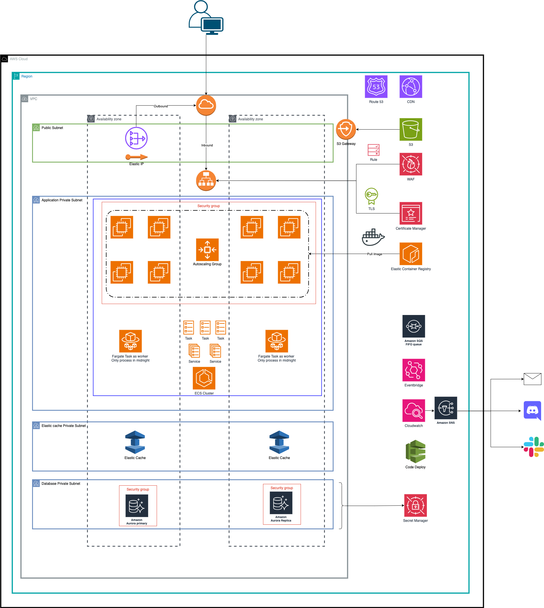

# AWS Deployment Architecture
 
This repository outlines the architecture of an application deployed entirely using AWS services. The system is designed for high availability (HA) and uses a combination of Amazon ECS (Elastic Container Service), EC2 (Elastic Compute Cloud), and various AWS services for compute, storage, and networking.

## Overview

- **Compute Resources**: 
  - **ECS (EC2-based)**: Used as the primary compute layer for handling API requests.
  - **EC2 Fleet (Spot and On-Demand)**: EC2 instances are used for task processing with a combination of spot and on-demand fleets to optimize costs.
  - **ECS Fargate**: Used for tasks that require shorter durations, ideal for running non-persistent workloads.

- **High Availability Setup**: 
  - The infrastructure is designed for high availability by leveraging multiple **Availability Zones** across the AWS region.
  - EC2 instances and ECS tasks are distributed across availability zones to ensure fault tolerance.

- **Networking**:
  - **VPC** (Virtual Private Cloud) is used to isolate the environment and ensure secure communication between services.
  - Public and private subnets are used to manage traffic, with resources like Elastic Load Balancer (ELB) routing traffic to EC2 instances in the private subnet.

- **Storage & Data**:
  - **S3**: Used for object storage, providing a durable solution for storing application assets.
  - **Elastic Cache**: Used for caching to reduce database load and improve application performance.
  - **Aurora RDS**: Provides managed relational database services for storing application data.

- **Security**:
  - **Security Groups** are used to control access to the application, ensuring that only authorized traffic is allowed to reach the instances.
  - **Secret Manager**: Secures sensitive data like API keys, passwords, and database credentials.

- **Logging & Monitoring**:
  - **CloudWatch**: Monitors AWS resources and applications in real-time, sending logs and metrics to provide insights into system health.
  - **EventBridge**: Routes events to different services such as SNS for notifications.

- **CDN and Traffic Management**:
  - **Route 53**: Manages DNS and routes traffic to the appropriate services.
  - **CloudFront**: Distributes content via a global CDN, improving performance for users.

## Architecture Components

1. **ECS Cluster**: Manages Docker containers running in EC2 instances. The tasks are distributed across EC2 instances, with Spot and On-Demand instances providing a mix of cost efficiency and stability.
   
2. **Database Setup**: 
   - **Aurora RDS**: Managed relational database service to handle persistent application data.
   - **Elastic Cache**: Caches frequently accessed data, reducing database load and improving performance.

3. **Compute**:
   - **EC2 Instances**: Used to run ECS tasks. EC2 is chosen over Fargate for the main compute resources to reduce costs, using spot instances where applicable.
   - **Fargate**: Used for short-lived tasks that do not require the persistence or the cost of EC2 instances.

4. **Public Subnet**: 
   - Hosts services that require internet access, including Load Balancer and NAT Gateway for private instances.
   
5. **Private Subnet**:
   - Hosts application and database services, ensuring that internal services do not have direct internet access, improving security.

6. **Auto Scaling**: Automatically adjusts the number of EC2 instances based on the application load to maintain optimal performance while minimizing costs.

## Cost Optimization Strategies

- **EC2 Spot Fleet**: Using a combination of spot instances (for compute tasks) and on-demand instances helps to balance performance and cost efficiency.
- **ECS EC2-based**: ECS with EC2 instances provides better cost efficiency than Fargate, especially for long-running tasks or applications with high resource requirements.
- **Short-lived Tasks on Fargate**: Fargate is used for short-lived tasks, allowing the application to scale efficiently without the need to manage EC2 instances.

## Services Used

- **ECS (EC2-based)**: For running containerized applications on EC2 instances.
- **Fargate**: For managing short-lived containerized tasks.
- **S3**: For storing application data, logs, and static files.
- **Elastic Cache**: For caching data to reduce load on the database.
- **Aurora RDS**: For relational database management.
- **CloudWatch**: For monitoring the health of the application and services.
- **Route 53**: For DNS management.
- **CloudFront**: For caching and delivering static content globally.
- **WAF**: For securing the application from malicious traffic.

## Conclusion

This architecture ensures that the application is highly available, cost-effective, and secure. By leveraging a mix of EC2 spot fleets, ECS, and Fargate, the system can efficiently handle a variety of workloads while minimizing cloud expenses.
